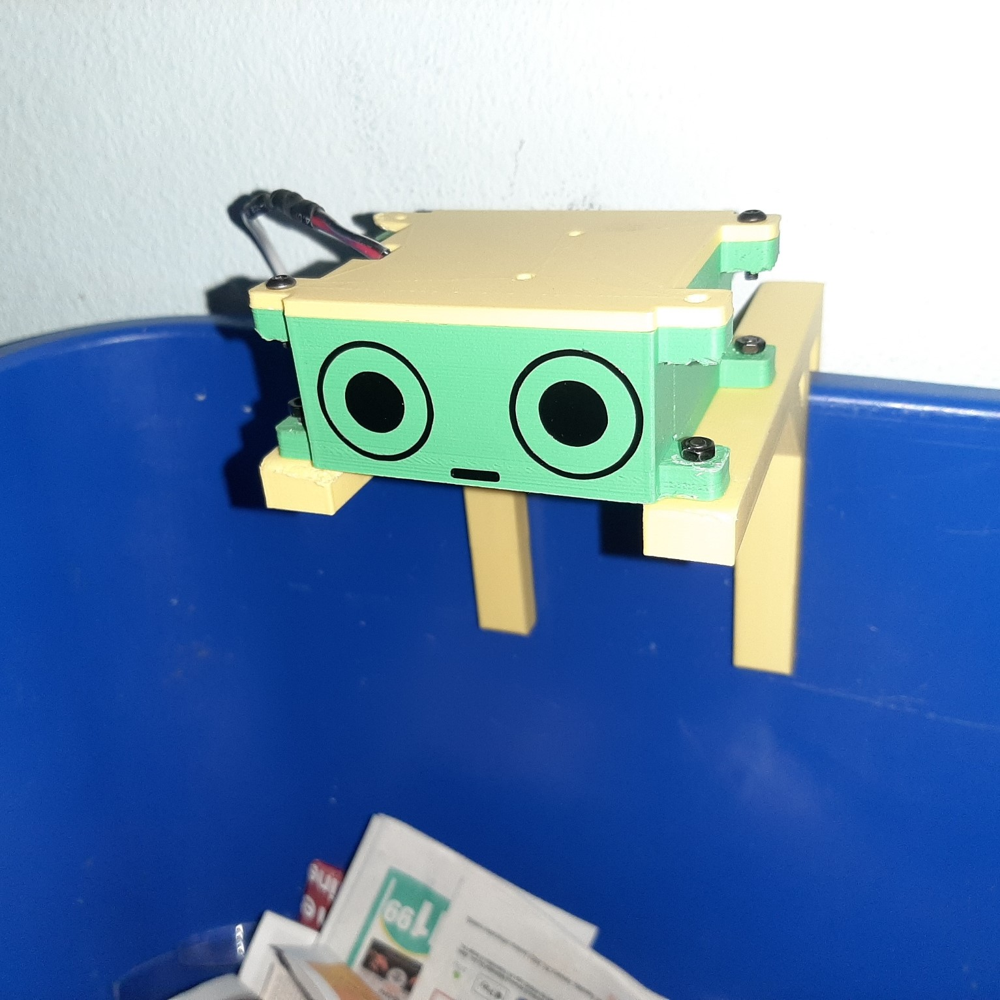

# Waste Watcher Adafruit IO

Waste Watcher is an IoT based sensor module to help keep track of waste data metrics with real-time bin fullness data and waste images. This is intended to help quantify and promote actionable solutions to reduce waste. This project is a continuation of [waste_watcher](https://github.com/zotbins/waste_watcher).

## Features

- 🗑 Collect waste bin fullness telemetry
- 📷 Capture image of inside the waste bin
- 🔧 Fully customizable (adjust data collection rate, tweak case design for your needs, change camera settings, etc.)

## Why?  ¯\\_(ツ)_/¯
Simply put, we generate way too much waste here in the United States 🤧. According to the [EPA](https://www.epa.gov/sites/default/files/2019-03/documents/infographic_full-060513_v4.pdf), 267.8 million tons of trash were generated. And even though the US represents 4% of the global population we generate 12% of global municipal solid waste, right behind India and China ( [Verisk Maplecroft, 2019](https://www.maplecroft.com/insights/analysis/us-tops-list-of-countries-fuelling-the-mounting-waste-crisis/)). The trash itself also presents other harmful environmental impacts. US landfills are the 3rd largest source of human-related methane emissions ([EPA](https://www.epa.gov/lmop/basic-information-about-landfill-gas)). Waste also affects 43% of marine mammals ([EPA 2017](https://19january2017snapshot.epa.gov/trash-free-waters/impacts-mismanaged-trash_.html)).

Waste monitoring systems already exist in commercial settings, ZotBins expands waste monitoring to the individual and community level. Some of these existing systems include [Bigbelly](https://bigbelly.com/), [Compology](https://compology.com/), and [Enevo](https://enevo.com/index.html). ZotBins is completely opensource. Built for people, by people.

## Adafruit IO

This repo, in particular, uses [Adafruit IO](https://io.adafruit.com/), an off-the-shelf IoT platform. For now, Adafruit IO is a great addition to this project and helps in the following ways:
- 🤗 Helps makes the project more user-friendly (no need to setup your own server, ready to use APIs, Dashboard feature)
- 🆓 Free to use F O R E V E R ╰(*°▽°*)╯ (according to their [website](https://io.adafruit.com/))
- 🤝 Great community on Discord willing to help people out
- 🔒 Data is never [sold](https://www.adafruit.com/iotbor/)

## Getting Started

Follow the [Build Guide](./build_guide.md) 🛠.

## Actionable Ideas for Your Waste Data

Besides just collecting data, here are some ideas that you can implement. Again the goal of this project is to help quantify and promote actionable solutions to reduce waste.

- 🎯 Create a goal to reduce the rate at which you fill up a bin
- 💻 Use the Adafruit IO Integrations (Zapier, IFTTT)
    - Send a summary of weekly fullness rate
    - Send alerts when bin is full
- 🤖 Use machine learning to identify what items are thrown always
    - identify frequently thrown away items then try to reduce that waste (eg. plastic straws are identified frequently in the waste stream, so we can ban the straw or give sustainable alternatives)
    - identify which waste items are incorrectly thrown away

## Contributors ✨

Thanks goes to these wonderful people ([emoji key](https://allcontributors.org/docs/en/emoji-key)):

<!-- ALL-CONTRIBUTORS-LIST:START - Do not remove or modify this section -->
<!-- prettier-ignore-start -->
<!-- markdownlint-disable -->
<table>
  <tr>
    <td align="center"><a href="https://github.com/patrickanguyen"> <b>Patrick Nguyen</b></a> <a href="https://github.com/zotbins/Waste_Watcher_Adafruit_IO/commits?author=patrickanguyen" title="Code">💻</a> <a href="https://github.com/zotbins/Waste_Watcher_Adafruit_IO/pulls?q=is%3Apr+reviewed-by%3Apatrickanguyen" title="Reviewed Pull Requests">👀</a></td>
  </tr>
</table>

<!-- markdownlint-restore -->
<!-- prettier-ignore-end -->

<!-- ALL-CONTRIBUTORS-LIST:END -->

This project follows the [all-contributors](https://github.com/all-contributors/all-contributors) specification. Contributions of any kind welcome!

## Credits/Acknowledgements

1. [ESP32Cam-MQTT by abish7643](https://github.com/abish7643/ESP32Cam-MQTT) - Great reference in how to send images through MQTT
2. [ESP32-CAM Projects by Random Nerd Tutorials](https://randomnerdtutorials.com/projects-esp32-cam/) - Quality background information on getting started with the ESP32-CAM

## How this Project Started

This project started at UCI in 2017 with a group of 4 undergraduates for a hackathon hosted by UCI TIPPERS. The aim of the project was to help create a tool to help with UCI's zero waste initiatives. Since then, the project is being shared to the open-source community through ZBCE and the ZotBins UCI undergraduate team continues with new members every year.

## Other Links

1. [License](LICENSE)
2. [Contributing](CONTRIBUTING.md)
3. [Code of Conduct](CODE_OF_CONDUCT.md)
